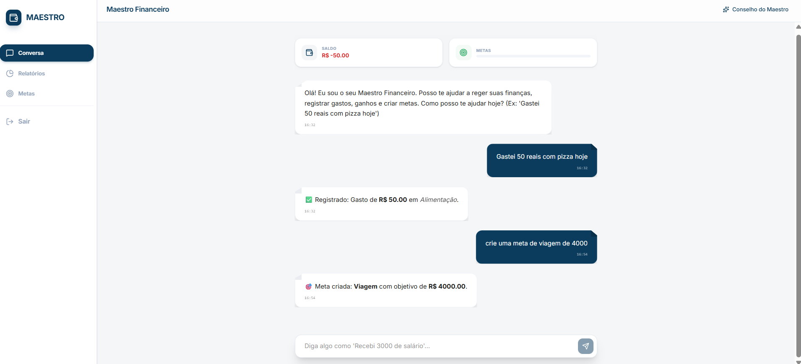
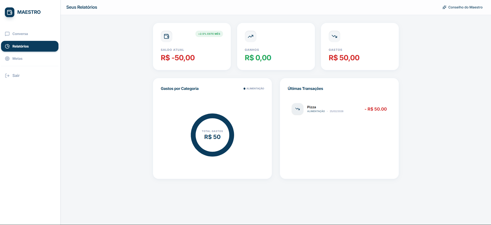
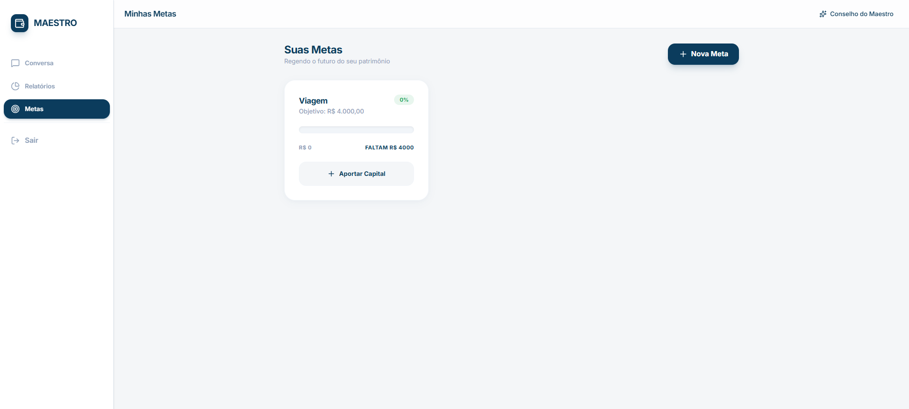

# 💸 App de Finanças Pessoais 

## 1. Contexto
A maioria dos aplicativos de finanças pessoais exige preenchimento manual constante, categorização manual e interfaces complexas. Muitas soluções não consideram diferentes necessidades de acessibilidade, criando barreiras para diversos públicos.

Este projeto propõe um aplicativo de finanças pessoais baseado em conversas, no qual o usuário interage com um Agente Financeiro em linguagem natural. A solução deve ser simples, acessível e utilizável pelo maior número de pessoas possível, seguindo os princípios de Design Universal.

---

## 2. Problema
Grande parte dos usuários abandona o controle financeiro por motivos como:

- Esforço contínuo exigido pelos aplicativos atuais  
- Interfaces pouco intuitivas  
- Barreiras cognitivas, técnicas ou de acessibilidade  
- Complexidade na categorização e interpretação de dados financeiros

**Problema central:**  
"Como permitir que iniciantes e pessoas diversas organizem suas finanças de forma natural, acessível e sem barreiras?"

---

## 3. Público-Alvo
- Pessoas iniciantes no controle financeiro  
- Usuários que preferem experiências simples e conversacionais  
- Pessoas com diferentes níveis de alfabetização digital  
- Usuários que precisam de interfaces acessíveis e inclusivas  
- Trabalhadores, estudantes, autônomos ou qualquer pessoa que deseja organizar suas finanças sem complexidade

---

## 4. Objetivo do Produto
Criar um aplicativo conversacional que torne o cuidado financeiro natural, acessível e inclusivo, usando linguagem clara, fluxo guiado e recomendações personalizadas. O produto deve aplicar princípios de Design Universal para garantir usabilidade ampla.

---

## 5. Princípio Essencial: Design Universal
- Uso equitativo por pessoas com diferentes capacidades  
- Flexibilidade de interação (texto, voz, toque)  
- Fluxos simples e intuitivos  
- Conteúdo perceptível mesmo com limitações visuais, auditivas ou cognitivas  
- Leitura facilitada (bom contraste, tipografia legível, hierarquia clara)  
- Compatibilidade com leitores de tela e navegação por teclado  
- Baixo esforço cognitivo nas principais tarefas  
- Interface funcional em diversos tamanhos de tela e contextos de uso

---

## 6. Protótipo e Funcionalidades-Chave

🔗 **Protótipo Interativo (use em navegador):**  
 https://ais-pre-oxfevzy4wuh2epci3uidqm-88767773203.us-east1.run.app

---

### 6.1 Tela de Login
- Tela inicial do sistema, permitindo acesso via email e chave de acesso  
- Inclui modo desenvolvedor para testes  

---

### 6.2 Conversa com o Agente Financeiro
- Registrar gastos e ganhos apenas digitando mensagens em linguagem natural  
- IA identifica automaticamente valor e categoria, registrando a transação  

Exemplo de interface do chat:

---

### 6.3 Relatórios Simples e Inclusivos
- Visualizações claras e compreensíveis  
- Alternativas para usuários com baixa familiaridade com gráficos  
- Textos explicativos complementando os visuais  

Exemplo da aba de Relatórios:

---

### 6.4 Metas Financeiras
- Definição de metas simples  
- Acompanhamento visual com linguagem acessível  

Exemplo da aba de Metas:

---

## 7. Entregável da IA (para uso no Lovable)

A IA deve produzir:

### 7.1 Plano de MVP
- Telas principais  
- Recursos necessários  
- Fluxo inicial de onboarding

### 7.2 Esboço das Telas
- Com aplicação explícita de Design Universal

### 7.3 Checklist de Validação
- Usabilidade  
- Acessibilidade  
- Clareza da linguagem natural

### 7.4 Estilo de Comunicação
- Linguagem educativa, acessível e adequada para iniciantes
